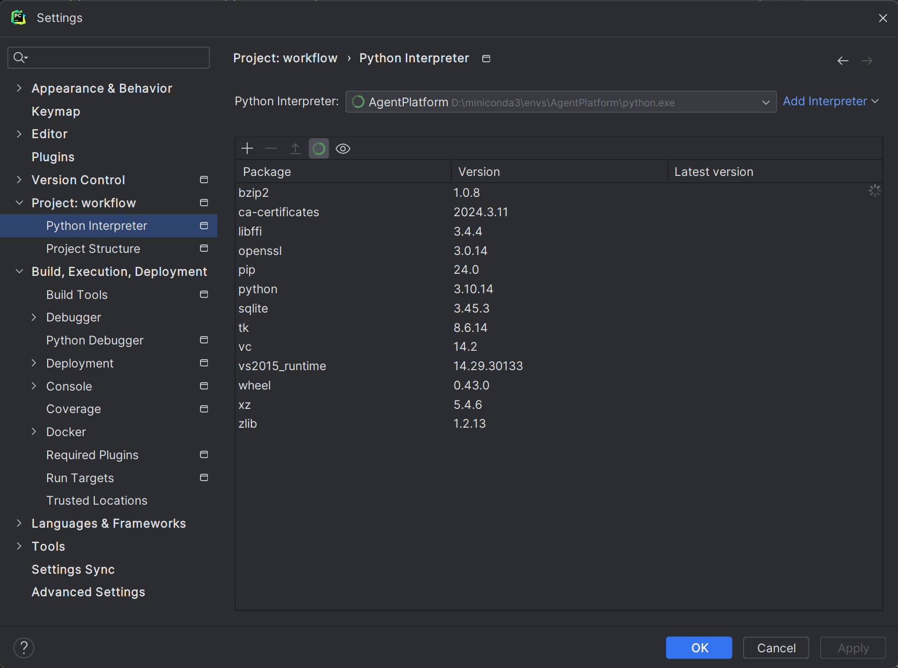
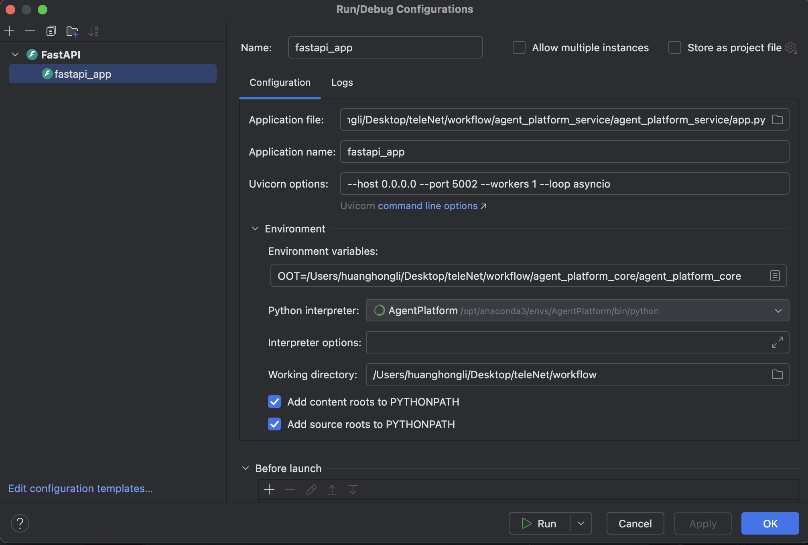
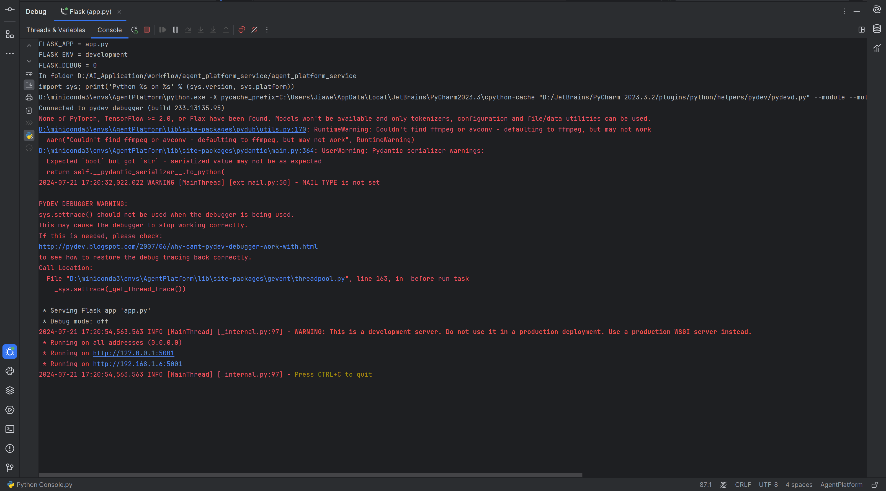
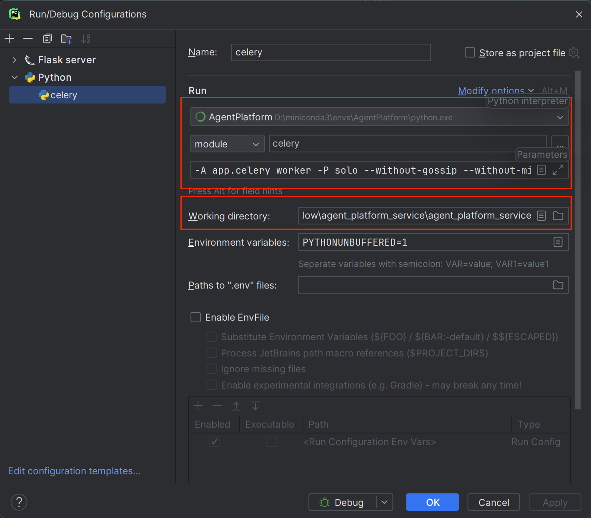
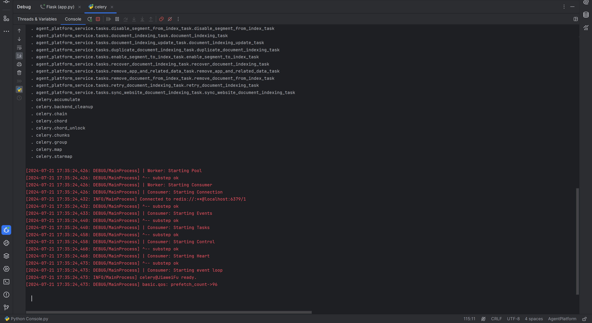

# Agent Platform Backend API

AgentPlatform 是一个用于构建 LLM 的应用智能体开放平台。其直观的界面结合了 AI 工作流、RAG 管道、Agent、模型管理、可观测性功能等，让您可以快速从原型到生产。

## 后端整体服务本地启动并进行 `DEBUG`

> 1. 后端服务依赖一部分中间件，需要使用到 `PostgreSQL` ,`Redis`, `Minio` , `Celery` 等, 请根据具体的中间件配置在`agent_platform_service` 中
> `app.py` 同目录下的 `.env` 文件中

```.dotenv
# ====================================================== PostgreSQL 配置 ================================================
# PostgreSQL database configuration
DB_USERNAME=
DB_PASSWORD=
DB_HOST=
DB_PORT=
DB_DATABASE=
SQLALCHEMY_ECHO=

# ===================================================== Redis 配置 ======================================================
# Redis configuration
REDIS_HOST=
REDIS_PORT=
REDIS_USERNAME=
REDIS_PASSWORD=
REDIS_DB=0

# ===================================================== 文件存储 配置 =====================================================
# storage type: local, s3
STORAGE_TYPE=s3
S3_USE_AWS_MANAGED_IAM=
S3_ENDPOINT=
S3_BUCKET_NAME=
S3_ACCESS_KEY=
S3_SECRET_KEY=

```

> 2. 为防止与其它项目环境产生冲突，本项目采用 `Miniconda + Poetry` 进行环境隔离配置及依赖管理。 
> 创建虚拟环境 `--name AgentPlatform`, 
> 并安装 `python=3.10.14` 基础 `python` 环境 , 为后续环境版本统一做准备

```bash
conda create --name AgentPlatform python=3.10.14

conda activate AgentPlatform
```


> 3. 进入到虚拟环境后，在项目根目录下安装 `poetry` 依赖管理工具，并通过 `poetry install` 安装项目所需依赖信息

```bash
 pip install poetry
 
 poetry install
```

> 4. 如果需要对单独模块进行改动或开发,则需要进入到对应子模块中 `poetry.toml` 文件的同级目录进行依赖安装(这里以 `agent_platform_core` 为例)


```shell
cd agent_platform_core

poetry lock --no-update

poetry install
```

> 5. 配置 PyCharm 并启动项目

*5.1 设置 `PyCharm` 项目运行环境,这里是需要选择之前通过 `MiniConda` 创建的虚拟环境。*



*5.2 根据实际情况配置项目启动项*

--host 0.0.0.0 --port 5002 --workers 1 --loop asyncio
METAGPT_PROJECT_ROOT= /.../

*5.3 启动项目即可,启动日志如下图所示*



## 异步任务服务本地启动并进行 `DEBUG`

> 1. 进入到 `agent_platform_service` 通过修改 `.env` 中配置 `Celery` 的 相关配置信息

```dotenv
# ===================================================== Celery 配置 =====================================================
#CELERY_BROKER_URL=redis://:${REDIS_PASSWORD}@${REDIS_HOST}:${REDIS_PORT}/${REDIS_DB}

CELERY_BROKER_SCHEMA=
CELERY_BROKER_USERNAME=
CELERY_BROKER_PASSWORD=
CELERY_BROKER_ENDPOINT=127.0.0.1:6379/1
BROKER_USE_SSL=
```

> 2. 配置启动项用于异步任务 `DEBUG`

*-A app.celery worker -P solo --without-gossip --without-mingle -Q dataset,generation,mail,ops_trace --loglevel DEBUG*



*Windows*

```bash
celery -A app.celery worker -P solo --without-gossip --without-mingle -Q dataset,generation,mail,ops_trace --loglevel INFO
```

*MacOS or Linux*
```bash
celery -A app.celery worker -P gevent -c 1 --loglevel INFO -Q dataset,generation,mail,ops_trace
```

*启动成功如下图所示*



## 项目代码提交规范

- `feat`: 新功能
- `fix`:  修复bug
- `docs`: 文档修改
- `pref`: 性能优化
- `revert`: 版本回退
- `ci`: CICD 集成相关
- `test`: 添加测试代码
- `refactor`: 代码重构
- `build`: 影响项目构建或依赖修改
- `style`: 不影响程序逻辑的代码修改
- `chore`: 不属于以上任何类型的其他类型(日常事务)
- `init`: 代码初始化操作

> 样例
>
> 
> `feat: 1. 新增 xxx ;` 
> 
> `fix: 1. 修复 xxx ;`